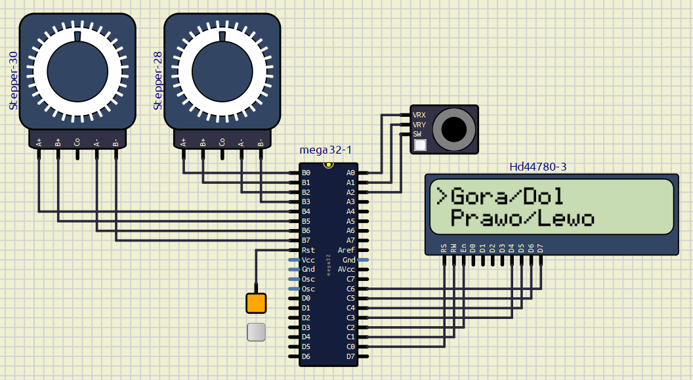

# ATmega32 Dual Stepper Motor Control



Embedded control system for two stepper motors using an ATmega32 microcontroller, an analog joystick and an HD44780 LCD.

The joystick is used to control two independent axes. A button integrated into the joystick switches between horizontal and vertical control modes, while the LCD displays the currently selected direction.

## Features

- Two stepper motors controlled independently
- Analog joystick input
- Joystick push-button for mode selection
- 10-bit ADC-based position reading
- HD44780 LCD in 4-bit mode
- Direction control based on joystick position
- Modular embedded C firmware
- Direct AVR register-level programming

## System Architecture

```text
                    ┌───────────────┐
                    │ Analog        │
                    │ Joystick      │
                    │ X / Y / SW    │
                    └───────┬───────┘
                            │
                            ▼
                     ┌─────────────┐
                     │  ATmega32   │────────> HD44780 LCD
                     │ ADC + GPIO  │
                     └───┬─────┬───┘
                         │     │
              ┌──────────┘     └──────────┐
              ▼                           ▼
        ┌────────────┐              ┌────────────┐
        │ Stepper 1  │              │ Stepper 2  │
        └────────────┘              └────────────┘
```


## How It Works

1. The joystick X and Y axes are read using the ATmega32 ADC.
2. The joystick push-button switches between horizontal and vertical control modes.
3. In horizontal mode, the X axis controls the first stepper motor.
4. In vertical mode, the Y axis controls the second stepper motor.
5. The joystick direction determines the rotation direction of the selected motor.
6. The LCD displays the currently selected control mode.

## Hardware

- ATmega32
- Analog joystick with push-button
- 2 × stepper motors
- HD44780-compatible 16×2 LCD

## Technologies

- C
- Embedded C
- AVR
- ATmega32
- AVR GPIO
- ADC
- HD44780 LCD
- 4-bit LCD interface
- Register-level programming

## Joystick Input

The joystick uses two ADC channels for the X and Y axes.

A dead zone is defined to prevent unintended motor movement around the joystick center:

```text
JOY_MIN = 400
JOY_MAX = 600
```

Values above `JOY_MAX` and below `JOY_MIN` are interpreted as intentional joystick movement.

## Stepper Motor Control

Each motor is controlled using four GPIO lines.

The stepper driver maintains the current phase and advances or reverses the phase sequence depending on the selected direction.

```text
Direction
   │
   ├──► STEPPER_RIGHT ──► Phase sequence forward
   │
   └──► STEPPER_LEFT  ──► Phase sequence reverse
```

The two motors have separate control functions:

- `Stepper1Step()`
- `Stepper2Step()`

## LCD Interface

The HD44780-compatible LCD operates in 4-bit mode.

The firmware provides separate functions for displaying the two available control menus:

- `LCD_MenuTop()`
- `LCD_MenuBottom()`

## Firmware Structure

The firmware is organized into three functional modules within the Atmel Studio project:

```text
atmega32-dual-stepper-control/
├── main.c
├── joystick.c
├── joystick.h
├── lcd.c
├── lcd.h
├── stepper.c
└── stepper.h
```

The firmware is divided into three functional modules:

- `joystick.c/.h` — analog joystick and push-button handling
- `stepper.c/.h` — control of both stepper motors
- `lcd.c/.h` — HD44780 LCD interface

`main.c` integrates the modules and implements the application logic.

## Project Status

**Completed and tested in simulation.**

## Possible Improvements

- Replace blocking delays with timer-based control
- Add variable motor speed based on joystick displacement
- Add acceleration and deceleration profiles
- Add position tracking
- Add configurable step resolution
- Improve LCD driver abstraction

## Author

**Konrad Misztela**

Intelligent Electronics  
Wrocław University of Science and Technology